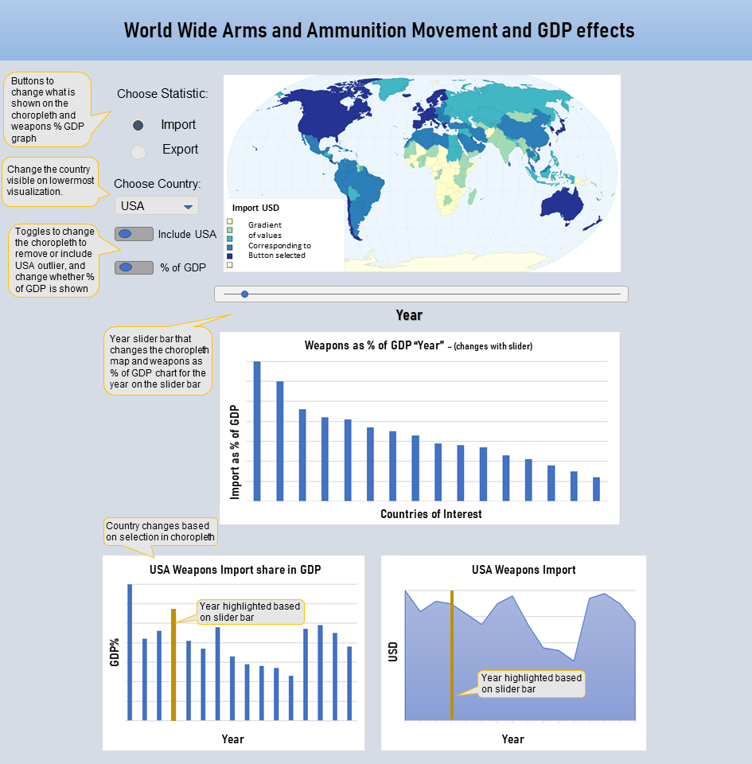

# Report on Global Weapon Trade and its Relationship with GDP

## About
This repository was created as part of an assignment in [UBC's Master of Data Science](https://masterdatascience.ubc.ca/) program. The goal of the assignment is to create an interactive dashboard that effectively visualizes specified research questions.

[The interactive dashboard can be found here](https://app.slack.com/client/T17KZ4CR4/GQSQS6V1U)

## Description 

The app has a single landing page that shows four plots that change based on a slider bar that changes the year shown, and three buttons. The three buttons specify import, export and net import (imports less exports) of weapons for each country globally.  All four graphs change according to the button selected. The first graph is a global choropleth of each country with the colour shaded to the scale generated by the button selected. The bar graph below has a set of countries of interest (selections will be made that appropriately show major importers/exporters) with their import, export or net import (based on the button) plotted as a percentage of GDP. For both the global choropleth plot, and the percentage of GDP plot, the data plotted changes with a slider bar that changes the year. The global choropleth chart is interactive, and you can select a country on the map. The data for that country is displayed on the bottom two graphs. The default of the bottom 2 charts will show USA data. This allows a comparison between global changes and the specified country. The data plotted for the bottom two country specific graphs does not change with the year slider, however a line moves along the two graphs that highlights the year selected by the slider bar to enable easy comparison.

Please see the [Proposal](proposal.md) to further understand the purpose, motivation, data and research questions behind the report.

## Repository Structure
- [app](app) - the interactive Dashboard code (Python + Dash)
- [data](data) - datasets used for the report
    - [dirty](data/dirty) - unmodified original datasets
    - [clean](data/clean) - cleaned tidy datasets
        - [gdp_1960_2018_worldbank.csv](data/clean/gdp_1960_2018_worldbank.csv) - cleaned [Worldwide Arms and Ammunition Trading](http://data.un.org/Data.aspx?d=ComTrade&f=_l1Code%3a93) dataset
        - [un-arms-and-ammunition_1988-2018.csv](data/clean/un-arms-and-ammunition_1988-2018.csv) - cleaned [GDP by Country](https://data.worldbank.org/indicator/NY.GDP.MKTP.CD) dataset
- [doc](doc) - additional documentation and records
- [media](media) - images and other media resources used in the report and related documentation
- [scripts](scripts) - a set of useful scripts for the report
    - [clean-data.py](scripts/clean-data.py) - a Python script to prepare the original data and transform it to clean tidy form
- [proposal.md](proposal.md) - primary Proposal document with detailed description of research questions, data and purpose / motivation behind the report   

## Contributing Policy
Please note that all contributions are subject to the [Code of Conduct]('CODE_OF_CONDUCT.md').

We welcome contributions to this project! If you find a bug, have a feature request, or have general suggestions to improve this repository, please submit an issue, or feel free to fork this repository and submit a pull request.
